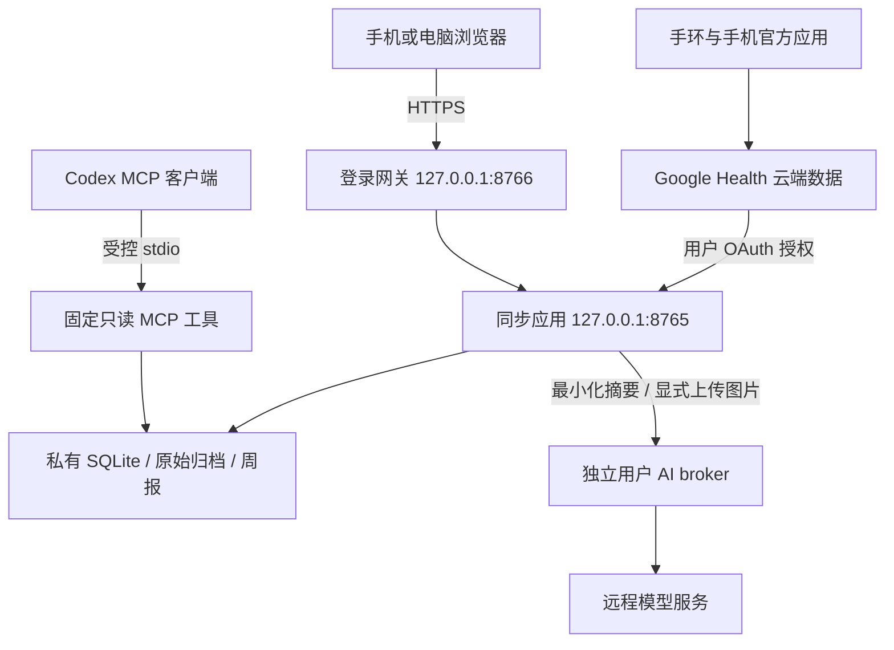

# Air Health：从 Fitbit 手环到私有健康数据网站

轻量、单用户的 Google Health API 健康看板参考实现。把已授权的活动、睡眠、运动、心率和其他可用记录同步到自己的 Linux 服务器，并通过网页查看趋势、运动详情、AI 解读和健康周报。

> 这是脱敏教学快照，不是经过独立安全审计的生产发行版，不提供医疗诊断或治疗建议。仓库只有代码和教程，不包含 Google 凭据、AI 登录态、真实健康数据、路线、运行日志或个人截图。

## 教程导航

- [完整部署教程：从设备、OAuth 到 AI、MCP 和运维](docs/TUTORIAL.md)
- [没有服务器？免费云服务器与费用避坑](docs/FREE_CLOUD.md)
- [下载 39 页 PDF 教程](docs/deployment-tutorial.pdf)
- [隐私与安全要求](SECURITY.md)
- [教学快照说明与已知限制](README-教学说明.md)

文档核对日期：**2026-09-08**。Google Cloud 免费额度、API、Codex CLI 参数和模型权限会变化，请在创建资源或升级前检查官方说明。

## 功能范围

| 模块 | 主要能力 |
| --- | --- |
| 总览 | 当天活动快照、最近夜间指标、数据日期和同步状态 |
| 活动与训练 | 运动列表、可点击详情、心率图、强度结构、热量与历史对比 |
| 睡眠与恢复 | 睡眠时段和分期、时长、HRV、静息心率、可用夜间指标 |
| 健康与趋势 | 血氧、呼吸率、温度与身体测量等已有记录；长期趋势和数据覆盖 |
| 周报与日报 | 本地规则分析、可选 AI 叙述、JSON 归档和 systemd 定时任务 |
| 自由问答 | 文字问答、模型选择、一张受大小限制的图片；健康摘要默认不附带 |
| MCP | 六类固定只读工具，供 Codex 查询已同步的数据库 |
| 私有访问 | SSH 隧道、单用户登录网关、可选 HTTPS 隧道 |
| 运维 | 原始记录归档、应用备份、完整性核验与恢复指引 |

**API 有某类数据，不代表你的设备能测量或账号已有记录。** 不要宣称手环能直接测尿酸、血糖；没有记录时应保持为空。新增 API 类型也不一定已被此快照实现。周报当前以核心指标为主，不是自动纳入全部同步类型。

## 架构与安全边界



- **Google OAuth**：允许服务器读取本人的云端记录。
- **网站登录**：限制谁能看到已经同步到服务器的健康数据。
- **AI 登录**：决定模型访问权限、使用额度与费用。

这三种身份机制不能互相代替。不要对公网直接开放主应用、SQLite、MCP 或配置入口。GitHub 仓库和 GitHub Pages 也不等于你的健康数据托管服务。

## 1. 没有自己的服务器怎么办？

可以使用云厂商的免费额度，或已有的 Linux 小主机。Google Cloud 的参考主线是指定美国区域的 **e2-micro + 标准持久磁盘**，并核对每月资源总额。不是任意区域、任意磁盘都免费。

务必注意：

- 新用户 **Free Trial** 与持续 **Free Tier** 是不同计划。
- 免费计算资源不等于整套系统零费用。公网 IPv4、出口流量、额外磁盘、快照和 AI 可能收费。
- 普通预算提醒不会自动封顶；不要以为设置小额预算后就绝不会继续扣费。
- e2-micro 约 1 GB 内存，先部署基础看板、小范围同步，再按需测试 AI。
- Oracle Always Free 是备选，但有账号资格、主区域、容量和空闲回收约束；不承诺申请成功。

完整配置和官方依据见 [免费云服务器专章](docs/FREE_CLOUD.md)。用户提供的知乎链接本次返回 403，未将未核验正文作为计费或配置依据。

## 2. 准备环境

主线使用 Linux、Python 3、systemd 和 SSH；Python 应用使用标准库。以下命令在 Ubuntu / Debian 执行：

```bash
sudo apt update
sudo apt install -y python3 ca-certificates unzip curl
python3 --version
timedatectl status
df -h /var/lib
```

服务器需能够通过合法可用的网络访问 Google OAuth 和 Health API；使用 AI 还需要模型服务连通性。不要关闭 TLS 校验。

获取本仓库源码后进入仓库根目录。可以使用 GitHub 的 **Code → Download ZIP** 解压，也可以使用页面显示的克隆地址。

## 3. 安装基础服务

```bash
sudo bash install-base.sh
sudo systemctl status air-health --no-pager
```

安装脚本：

- 只接受新安装；发现 `/opt/air-health/app.py` 已存在时停止，不覆盖旧服务。
- 创建 `airhealth` 专用用户。
- 代码放在 `/opt/air-health`，数据放在 `/var/lib/air-health`（0700）。
- 主应用只监听 `127.0.0.1:8765`。
- 不自动启用定时器、AI 或公网访问，不自动安装 cloudflared / Codex。

在自己的电脑另开终端，使用你自己的 SSH 别名：

```bash
ssh -N -L 127.0.0.1:8765:127.0.0.1:8765 health-server
```

保持窗口连接，在**同一台电脑**打开 `http://localhost:8765/`。手机的 localhost 指向手机本身，不能用来完成电脑发起的回调。

## 4. 配置 Google Cloud OAuth

1. 创建独立 Cloud 项目，在 API 库启用 **Google Health API**，服务名称应为 `health.googleapis.com`。
2. 在 Google Auth Platform 配置应用名称与联系邮箱。个人测试通常选择 External、Testing。
3. 在 Audience / Test users 中添加将要授权的 Google 账号。
4. 创建 **Web application** 类型的 OAuth Client。
5. 将下面地址加入**已获授权的重定向 URI**，而不是 JavaScript 来源：

```text
http://localhost:8765/oauth/callback
```

6. 在 Data Access 配置按需的只读 scopes。快照完整列表如下；不用的类别可以同时从 Cloud 和代码中移除：

```text
https://www.googleapis.com/auth/googlehealth.activity_and_fitness.readonly
https://www.googleapis.com/auth/googlehealth.health_metrics_and_measurements.readonly
https://www.googleapis.com/auth/googlehealth.sleep.readonly
https://www.googleapis.com/auth/googlehealth.settings.readonly
https://www.googleapis.com/auth/googlehealth.profile.readonly
https://www.googleapis.com/auth/googlehealth.nutrition.readonly
https://www.googleapis.com/auth/googlehealth.location.readonly
https://www.googleapis.com/auth/googlehealth.ecg.readonly
https://www.googleapis.com/auth/googlehealth.irn.readonly
```

7. 通过 SSH 隧道内的初始化页面输入自己的 Client ID / Secret，完成 Google 官方授权页的同意流程。Google 密码不应输入自建面板。
8. 等待首次同步，先对比少量同日期记录。“已连接”不代表全部数据已经同步完成。

官方设置说明：[Google Health setup](https://developers.google.com/health/setup)、[scopes](https://developers.google.com/health/scopes)。不要把 Cloud Healthcare API、旧 Google Fit 或旧 Fitbit Web API 的路径和授权混在一起。

## 5. 数据同步与新鲜度

手环先与手机同步，服务器再查询 Google 云端。网页“同步”不能远程触发手环蓝牙同步。

- 已结束日期使用支持的日级汇总接口。
- 当天通过原始 / reconcile 记录构建快照。
- 最新心率、静息心率和夜间 HRV 分开标注日期。
- 接口分页、时间过滤、单位、数据源与缺失状态需要逐类处理。
- 真实 0、没有数据、没有权限、同步失败是不同状态。

当前快照仍有一些生产化限制：已有历史归档可能跳过晚到记录；部分汇总和原始数据源口径不同；同步锁不跨进程。详见 [完整教程](docs/TUTORIAL.md) 和 [快照说明](README-教学说明.md)。

## 6. 手机可访问的 HTTPS 网站

先安装登录网关：

```bash
sudo python3 configure-web.py
sudo install -m 0644 air-health-web-gateway.service /etc/systemd/system/
sudo systemctl daemon-reload
sudo systemctl enable --now air-health-web-gateway
curl -i http://127.0.0.1:8766/api/status
```

预期未登录 API 返回 **401**。配置器不回显密码，拒绝覆盖已有配置；用户名为 `healthdemo`，请使用密码管理器生成唯一长随机密码。真正登录使用 HTTPS，因为 Cookie 带有 Secure 属性。

安装官方 cloudflared 后，先前台测试：

```bash
cloudflared tunnel --no-autoupdate --protocol http2 \
  --url http://127.0.0.1:8766
```

手机打开命令输出的随机 HTTPS 地址，先登录再查看数据。**只代理 8766，不代理 8765。** 初次 OAuth 仍通过电脑 SSH 隧道完成。

Quick Tunnel 是演示方案，地址和能力有限；长期使用请配置自己的域名、命名隧道或 HTTPS 反向代理，以及更成熟的身份认证。细节见完整教程。

## 7. AI、自选模型与图片

AI 是可选项，缺少 AI 账号时基础看板仍可用。参考结构为：

- `airhealth` 用户运行同步与主应用。
- `airhealth-ai` 独立用户运行 `ai_broker.py`。
- 通过 `/run/air-health-ai/agent.sock` 传递有界摘要。
- AI 用户不能直接读取 0700 的 Google 数据目录。

按官方说明安装完整 Codex CLI，使用自己的账号为独立用户登录；核对 broker 中 `/usr/local/libexec/air-health-codex` 入口和当前 CLI 参数。不要复制管理员登录缓存，不要为修复错误而关闭隔离。

快照的模型菜单是历史白名单，不保证每个账号可用；需要同步检查 `app.py`、`ai_broker.py` 和前端菜单。使用 `auto` 与指定模型分别测试。

自由问答默认不附带健康摘要；只有明确开启时才发送。支持一张 PNG / JPEG / WebP，后端解码上限为 3 MB，并校验文件头。图片正常请求结束后清理，但崩溃残留、EXIF 和上游保留策略仍需另外管理。不要上传未脱敏的证件、化验条码或他人健康资料。

`--ephemeral` 和只读沙箱并不意味着供应商零保留，也不等于无工具能力。详情、部署命令、健康指导专题见 [完整教程](docs/TUTORIAL.md)。

## 8. MCP 只读工具

`mcp_server.py` 提供：

```text
get_health_summary
get_metric_series
get_sleep_history
get_workouts
analyze_health
list_health_metrics
```

MCP 读取已有 SQLite，不需要模型持有 Google 令牌。通过受控 stdio 在本机或 SSH 上运行；不要开放到公网。配置需要精确的执行权限，不应授予通用免密 sudo。

## 9. 周报、定时任务与备份

建议先手动验证，再选择性启用配套 systemd timers：

| 任务 | 参考计划 | 注意 |
| --- | --- | --- |
| sync | 每 30 分钟，带抖动 | 首次回填结束后启用；避免与手动同步重叠 |
| daily-brief | 每天 08:20 | 日报与 AI 可选 |
| weekly-report | 周一 08:10 | CLI 以昨天为结束日；周一运行才对应上周一至周日 |
| backup | 每天 03:40 | 保存副本、校验完整性，定期演练恢复 |

日报、周报和备份计划使用 `Asia/Hong_Kong`；请检查服务器和使用者时区，按自己的情况调整。

```bash
sudo -u airhealth env HEALTH_DATA_DIR=/var/lib/air-health \
  python3 /opt/air-health/app.py weekly-report

sudo -u airhealth env HEALTH_DATA_DIR=/var/lib/air-health \
  python3 /opt/air-health/app.py backup

sudo -u airhealth env HEALTH_DATA_DIR=/var/lib/air-health \
  python3 /opt/air-health/app.py backup-verify
```

备份排除 OAuth 配置和令牌，但仍含健康数据、路线和报告，**不是匿名或加密备份**。恢复前停止所有写入，在隔离目录验证，不要直接覆盖唯一副本。

## 10. 常见问题

| 现象 | 优先检查 |
| --- | --- |
| 403 access_denied | 是否加入正确项目的 Test users，授权账号是否正确 |
| redirect_uri_mismatch | 协议、localhost、端口、路径和尾斜杠必须完全一致 |
| OAuth state 校验失败 | 从连接入口重来，不刷新旧 callback；不要并发发起授权；状态有效期 10 分钟 |
| 一周后需重连 | Testing 状态的刷新令牌有效期；先核对授权而不是改服务配置 |
| 只看到昨天 | 设备上传、原始快照、查询窗口和页面数据日期 |
| 只有部分数据 | scopes、设备/地区支持、实际源记录、过滤字段与分页 |
| AI 无响应 | 独立账号、CLI 路径与参数、模型允许列表、socket 权限、网络 |
| 手机打不开 | HTTPS 隧道、网关状态和登录；不要直接开放主应用 |

更多排查路径和验收标准见 [完整教程](docs/TUTORIAL.md)。公开 Issue 中只提交脱敏错误码和步骤，不提交真实响应或日志。

## 安全与许可

请完整阅读 [SECURITY.md](SECURITY.md)。仓库是教学快照，未承诺多用户隔离、严格任务并发安全或临床有效性；面向他人运营前需要独立改造和审查。

当前未指定开源许可证；公开可见不自动授予复制、分发或商业使用许可。正式开源前应由代码权利人确定授权范围，并复核第三方许可。

## 参考

功能组织可参考 [FlavioAdamo/openfit](https://github.com/FlavioAdamo/openfit)，但本项目并非其官方分支，服务器部署与其桌面应用架构不同。完整教程包含 Google、OpenAI、Cloudflare、Oracle 和 SQLite 的官方参考链接。
